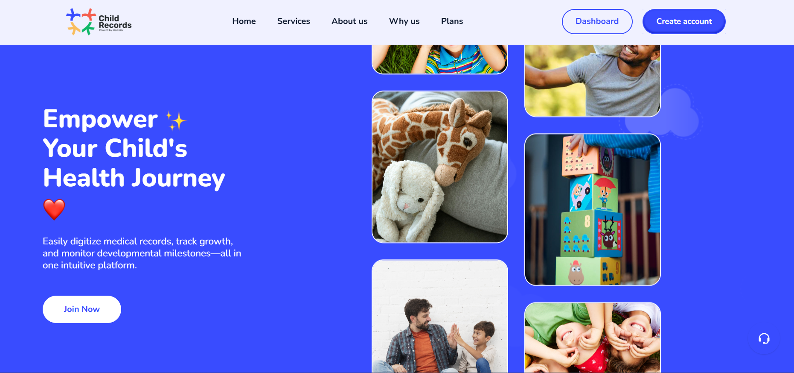
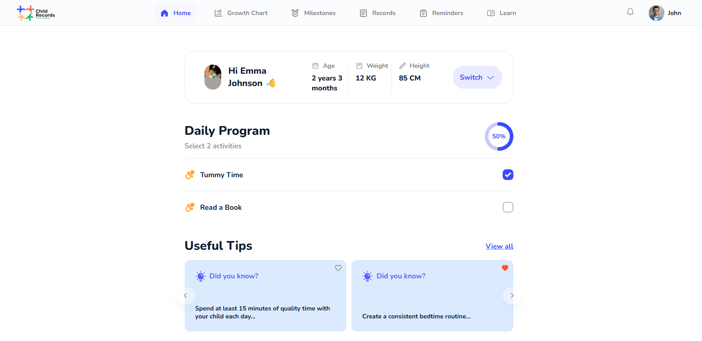
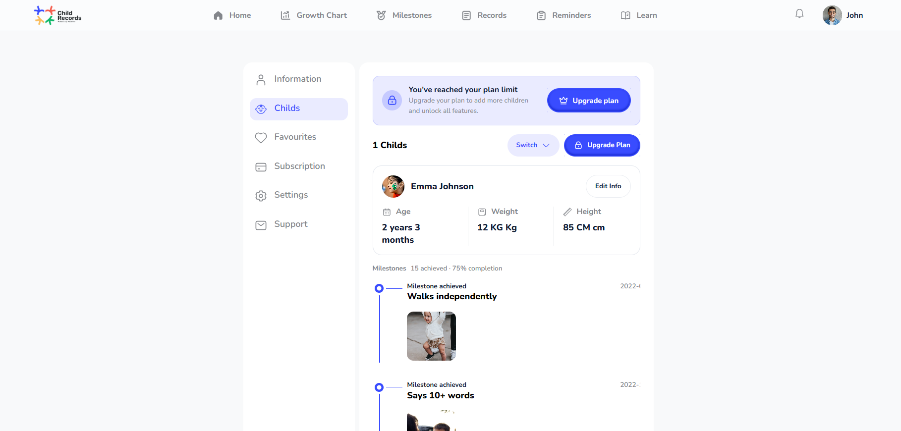
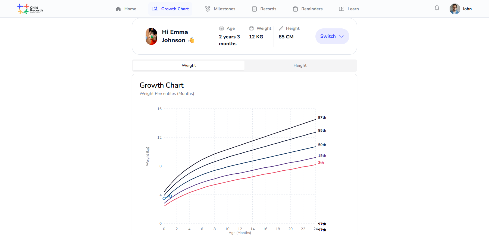
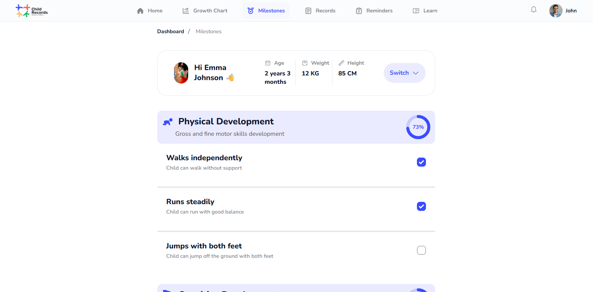

# Child Record Application

Child Record is a family-focused web application that helps parents track their children's growth, health records, and milestones in one place. It combines profile management, visual growth tracking, and milestone history so caregivers can monitor progress over time with a simple dashboard experience.

## Live Website

- **Domain**: [https://childrecord.kat-jr.com/](https://childrecord.kat-jr.com/)

## What This Website Is For

Based on the product landing experience, Child Record is designed to help families:

- Track child growth and development over time
- Record milestones and important life moments
- Manage child profiles and health-related records
- Get a clear dashboard view of each child's progress
- Use a mobile-friendly interface for day-to-day updates

## Product Screens

### Landing Page

### Dashboard

### Child Profile

### Growth Charts

### Milestones

## Core Services

Child Record helps families keep all child development information in one organized place:

- **Child Profiles**: Create and manage each child's personal and health-related information.
- **Growth Tracking**: Monitor development through visual charts and progress history.
- **Milestone Journal**: Record important moments and developmental achievements.
- **Progress Dashboard**: View each child's overall status from one clear screen.
- **Anytime Access**: Use the platform online from mobile or desktop whenever needed.

## Who It Helps

- Parents who want a structured way to follow their child's development
- Families managing records for more than one child
- Caregivers who need a quick, simple view of growth and milestone history

## Why Families Use Child Record

- Keeps records centralized and easy to review
- Makes growth patterns easier to understand
- Helps preserve important childhood moments
- Reduces the hassle of scattered notes and manual tracking
